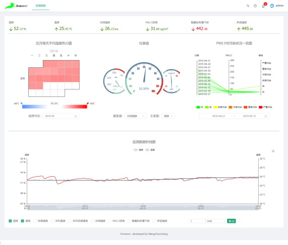

# Homenvi front

## 概述

获取和展示采集的数据。

## 实现

前端应用采用完全开源的React技术栈构建。使用Ant design构建UI、优秀的Echarts图形库来构建图表。

## 展示



## 测试

```shell
npm install
npm run start
```

## 部署

- 打包

```shell
npm run build
```

- 部署 

nginx 配置

```shell

server {
    listen       80;
    server_name  localhost;

    location / {
        root   D:\Workspace\me\Homenvi\homenvi-front\build
        index  index.html index.htm;
    }

    location /api {
        proxy_pass http://localhost:8880/;
    }

    location /influx {
        proxy_pass http://localhost:8086/;
    }
}
```